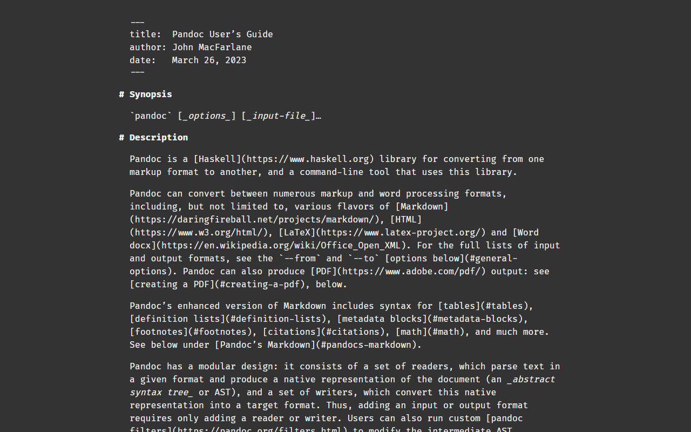

# markdown-css

A CSS stylesheet support almost all Markdown syntax, like headings, lists, tables, blockquotes, footnotes etc.

This is a project inspired by [markdown-css](https://github.com/mrcoles/markdown-css). I extend the original Markdown stylesheet.

## Support many Markdown features

Light Mode:

Dark Mode:

It support Pandoc Markdown syntax, include:

- Title block, YAML style
- Headings like [FoldingText](http://www.foldingtext.com/), aligned with chapter text instead of `#`
- Bullet lists
- Ordered lists
- Definition lists
- The four-space rule
- Links
- Tables
- Blockquotes
- Code (blocks)
- Emphasis
- Horizontal rules
- Footnotes

You can see the example below:

[Pandoc Manual HTML Version](http://www.pengdaiwu.com/assets/file/markdown-css-example.html) and [original source](https://cdn.jsdelivr.net/gh/jgm/pandoc/MANUAL.txt).

## Generate example

Generate CSS file:

    sass markdown.scss markdown.css

Generate example based on Pandoc Manual:

    pandoc https://cdn.jsdelivr.net/gh/jgm/pandoc/MANUAL.txt -o markdown-css-example.html -f markdown -t html5 -s -c ./markdown.css --no-highlight

Generate web page screenshot

    capture-website markdown-css-example.html --output=markdown-css-example.png --type=png --overwrite --scale-factor=1

    capture-website markdown-css-example.html --output=markdown-css-example-dark-mode.png --type=png --overwrite --scale-factor=1 --dark-mode

## Author

David Peng
